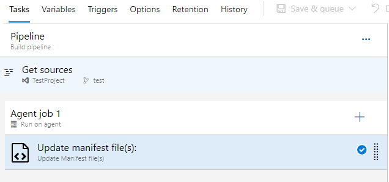
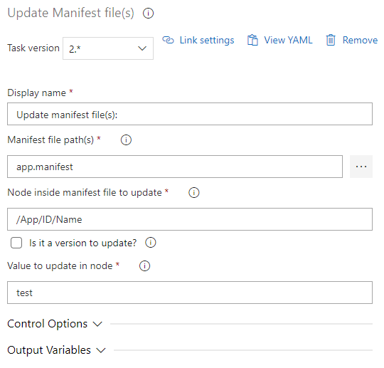
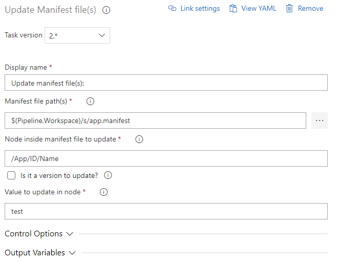
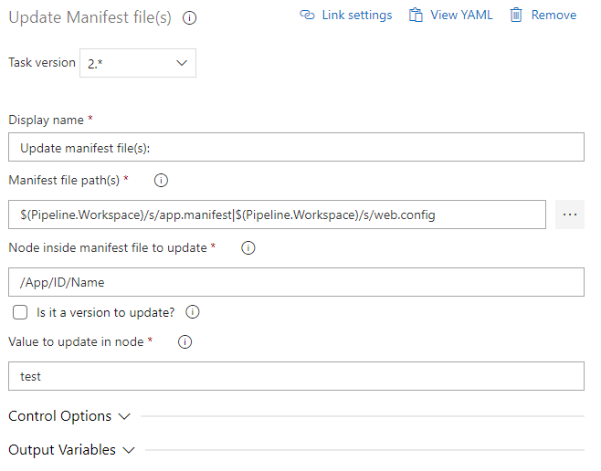
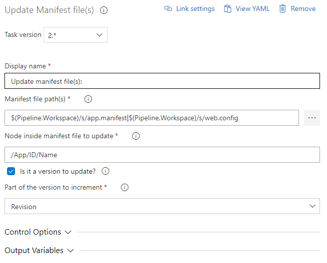

# Azure DevOps Update manifest file

## Introduction

This task helps to upate value in manifest file (it can also be used to update values in any XML based file).

## What can you do

* Update value(s) for node(s)
* Auto-increment version

## Screenshots

### Task List

### Task Properties (Value to update inside Node)

#### Specify one file (relative path)

#### Specify one file (absolute path)

#### Specify multiple files separated using `|` as delimiter. Absolute path is mandatory when specifying multiple files.

### Task Properties (Version to auto-increment inside Node)

